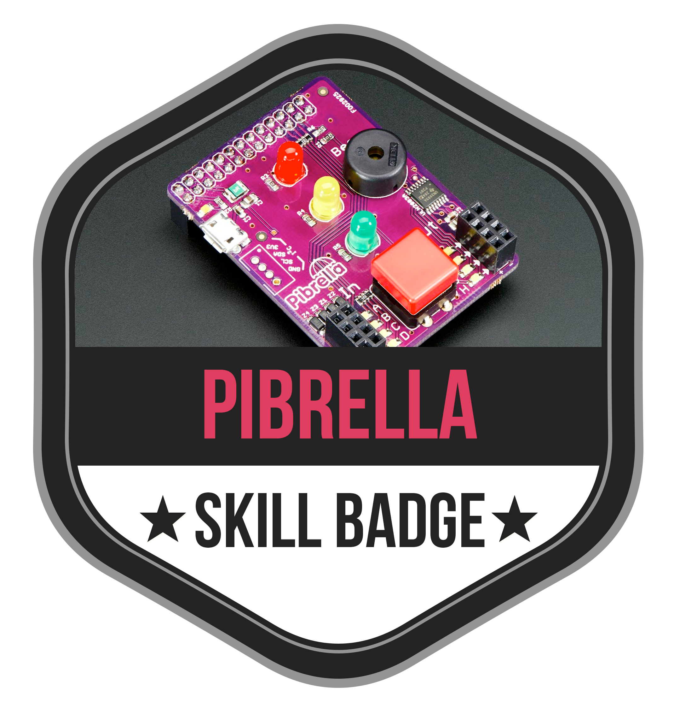

#PiBrella Skill Bagde

A handy collection of inputs and outputs

You can invent lots of cool little projects using the on-board button, lights
and speaker.

When you want to get more advanced you can attach your own inputs
and outputs to Pibrella to extend your projects.

It even has a USB power connector so it can deliver more juice to motors,
relays and solenoids connected to the outputs.

With LED indicators on all of the inputs and outputs it makes debugging
your projects a breeze...


More Info: http://goo.gl/oqfgCa

* Install the PiBrella board
* Install Software
* Turn LEDs on and off
* Make success sound on buzzer
* Turn leds on/off using the button
* Make success sund on button release
* Connect a motor to the output connection
* Make the motor go
* Input?
* Make something with what you have learned

Printables:

[Skill badge](Skill-badge.png)

[One Sheet](skill-badge_onesheet_pibrella.png)

[Card - Front : With bleeding edge](skill-badge_card_pibrella_front.png)

[Card - Back : With bleeding edge](skill-badge_card_pibrella_back.png)